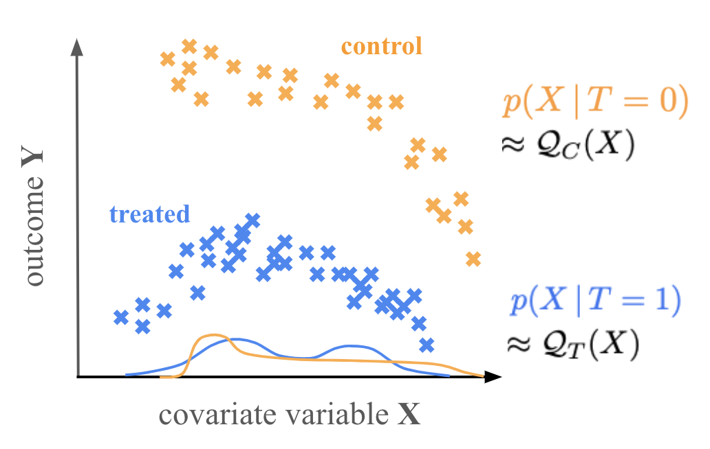

# `causalflow`
 and [Cano & Hahn (2024) Nature Comm. Accepted]().

A machine learning framework for measuring the causal treatment effect using normalizing flows. `causalflow` estimates the Conditional Average Treatment Effect (CATE) for some treatment `T`

## installation 

## `causalflow` scenarios

### Scenario A

Scenario A should be used when your treated and control samples are well sampled in X-space. This is the idea scenario for `causalflow`. 

Estimate the distribution of the outcome `Y` for both the treated and control samples. Then estimate the CATE as: 
$${\rm CATE} = \int {\rm Y}\,p(Y\,|\,X,T=1)\,{\rm d}{\rm Y} - \int {\rm Y}\,p(Y\,|\,X,T=0)\,{\rm d}{\rm Y} \approx \int {\rm Y}\,q_T(Y\,|\,X;\phi)\,{\rm d}{\rm Y} - \int {\rm Y}\,q_C(Y\,|\,X;\phi)\,{\rm d}{\rm Y} $$. 

In this Senario A, you can evaluate the CATE for any coviarate `X` as long as it's within the support. `causalflow` checks this by estimating the X distribution of the control and treated samples. 

In practice, for a given `X'`, `causalflow`checks whether `Q_C(X')` and `Q_T(X')` is above some user set threshold. Higher threshold is more conservative.

### Scenario B

Scenario B should be used when you have one sample (either treated or control) that's well sampled in X-space but the other sample is more sparsely sampled or stratified.  

Estimate the distribution of the outcome `Y` for a base (either treated/control) sample. Then the conditional treatment effect (CTE) for sample $(X', Y')$ in the other sparse (control/treated) sample is estimated as: 
$${\rm CTE} = Y' -  \int {\rm Y}\,p(Y\,|\,X,T=0)\,{\rm d}{\rm Y} \approx Y' -  \int {\rm Y}\,q_C(Y\,|\,X;\phi)\,{\rm d}{\rm Y} $$

Note CTE is *not* the CATE since this is a treatment effect for individual samples. However, if your other sample has enough data with e.g. clustered $X$s, then you can average the CTE to approximate CATE: 

$${\rm CATE} \approx \frac{1}{N}\sum\limits_{{\rm X'}\sim \{{\rm X}\,{\rm cluster}\}} {\rm CTE}(\rm X')$$

We caution that the accuracte of the CATE estimate will depend on the sample size of the chosen clusters. Also `causalflow` can only evaluate the CTE if X' is within the support of the base distribution. We use the same support test as in Scenario A with a user specified threshold. 

### Scenario C

Scenario C should be used when you a continuous treatment that varies in amplitude — i.e. there is no binary treated or control sample. 

`causalflow` can measure the CATE for some specified fiducial covariate X_fid and treatment T_fid for some specified "treatment" of magnitude dT. CATE is estimated as 

$${\rm CATE}(X_{\rm fid}) = \int {\rm Y}\,p(Y\,|\,X_{\rm fid}, T_{\rm fid} + \Delta T)\,{\rm d}{\rm Y} - \int {\rm Y}\,p(Y\,|\,X_{\rm fid}, T_{\rm fid})\,{\rm d}{\rm Y} \approx \int {\rm Y}\,q(Y\,|\,X_{\rm fid}, T_{\rm fid}+\Delta T;\phi)\,{\rm d}{\rm Y} - \int {\rm Y}\,q(Y\,|\,X_{\rm fid}, T_{\rm fid};\phi)\,{\rm d}{\rm Y}$$

`causalflow` can only evaluate the CATE if (X_fid, T_fid) and (X_fid, T_fid + dT) is within the support of the dataset. We use the same support test as Scenario A with a user specified threshold. 

