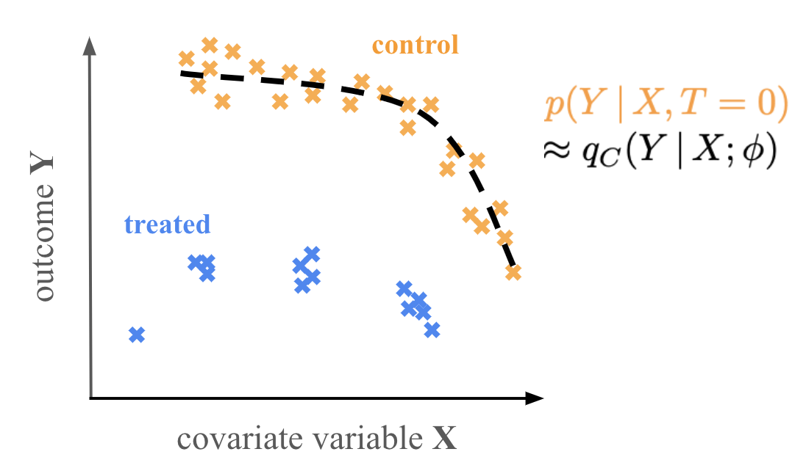

# `causalflow`

and [Cano & Hahn (2024) Nature Accepted]().

A machine learning framework for measuring the causal treatment effect using
normalizing flows. `causalflow` estimates the Conditional Average Treatment 
Effect (CATE) for some treatment `T`

## installation 

## `causalflow` scenarios

### Scenario A

